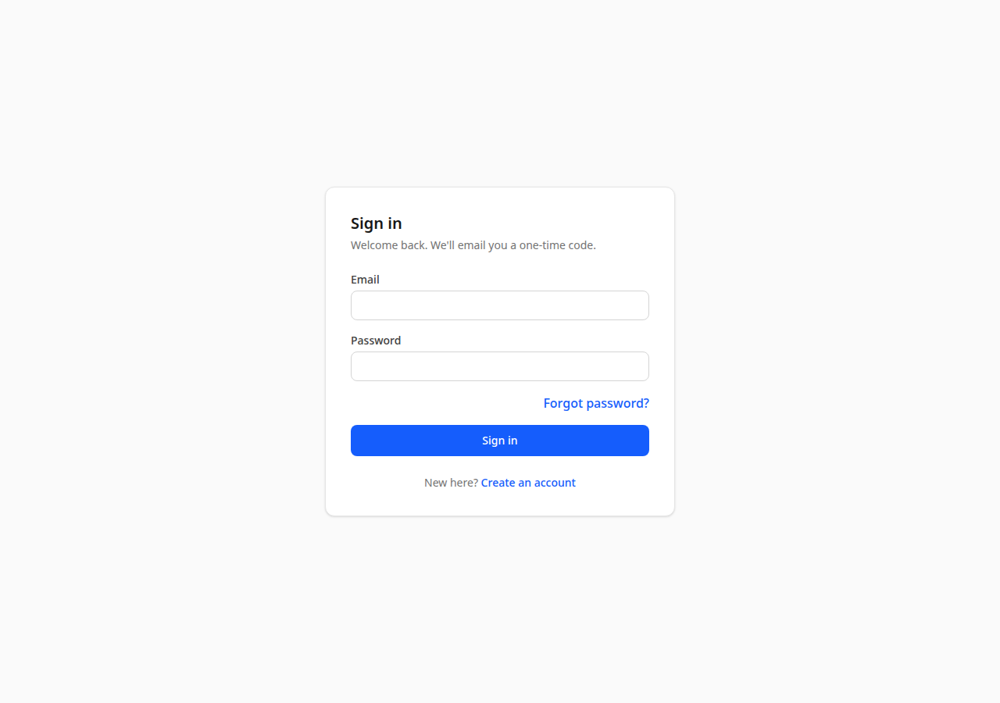

# Vehicle Maintenance Frontend

[](https://github.com/lmartinezcarbo/vehicle-maintenance-frontend/actions/workflows/ci.yml)

Web client for the **[Vehicle Maintenance API](https://github.com/lmartinezcarbo/vehicle-maintenance-api)** —
a workshop management app: vehicles, maintenance records with a lifecycle,
parts, expenses and Stripe payments, behind role-based access.

**Live demo:** <https://vehicle-maintenance-frontend-nine.vercel.app>



> The API runs on Render's free tier, so the first request after a quiet
> period can take **30–60 seconds** to wake up. The sign-in screen opens
> instantly; the first network call is the slow one.

## Demo accounts

The sign-in page shows **one-click demo buttons** (`Enter as customer /
mechanic / admin`): pick one and you are straight in — no email needed.
They only appear while the backend runs with `DEMO_MODE=true`, which is
the case for this live demo; a real deployment hides them.

The three seeded accounts, if you prefer the full password + emailed 2FA
flow. The addresses are the author's own, so the emailed code only reaches
those inboxes — use the demo buttons for a live walkthrough, or register
your own account to see the real verification + 2FA codes in *your* inbox:

| Role | Email | Password |
| --- | --- | --- |
| `customer` — owns the demo vehicle and pays | `lmartinezcarbo1994@gmail.com` | `ProdDemo-2026-vmapi` |
| `mechanic` | `lmartinezcarbo@gmail.com` | `MechDemo-2026-vmapi` |
| `admin` | `lmartinezcarbo+admin@gmail.com` | `AdminDemo-2026-vmapi` |

## What it does

* **Auth flow** — register, verify email, log in, 2FA, forgot/reset password,
  plus one-click demo login for the seeded accounts when the backend runs in
  demo mode
* **Vehicles** — list with search and pagination, detail, photo upload,
  and the mechanic verification step
* **Maintenance records** — create/edit, the `in_progress → ready →
  completed` lifecycle, parts and expenses attached to a record
* **Payments** — pay a `ready` record through Stripe Checkout and land back
  on the return page, which polls until the signed webhook settles it
* **Admin** — user role management and the parts catalog CRUD

## Tech stack

| Area | Tools |
| --- | --- |
| Framework | React 19, Vite 8, TypeScript |
| Routing | React Router 7 |
| Data & state | TanStack Query 5, React Context (session) |
| Styling | Tailwind CSS 4 (hand-rolled components, single light theme) |
| HTTP | `fetch` wrapper with one-shot refresh-token retry |
| Lint | Oxlint |

## Architecture notes

* **Data layer** — every resource has a typed hook in `src/hooks/`
  (`useVehicles`, `useRecords`, `usePayments`, …) built on a thin
  `src/lib/api.ts` client. That client attaches the bearer token, and on a
  `401` it refreshes once and replays the request; concurrent `401`s share
  a single refresh.
* **Session** — the signed-in user lives in a React Context; route guards
  (`RequireAuth`, `GuestOnly`) redirect based on it.
* **Tokens in `localStorage`** — deliberately simple. It is readable by any
  script on the page, so an XSS bug would leak the tokens; a product
  handling real money would move the refresh token into an `httpOnly`
  cookie. The trade-off is documented in `src/lib/tokens.ts`.
* **UI in English**, one light theme, no component library — the point is to
  show the wiring, not a design system.

## Getting started

```bash
npm install
cp .env.example .env.local      # VITE_API_URL, defaults to http://localhost:8000
npm run dev                     # http://localhost:5173
```

The dev server runs on **5173**; the backend repo ships a local-only
`docker-compose.override.yml` that adds `http://localhost:5173` to CORS.

### Scripts

```bash
npm run dev       # dev server (strict port)
npm run build     # tsc -b && vite build
npm run lint      # oxlint
npm run test      # vitest run (jsdom)
npm run preview   # serve the production build
```

Tests use **Vitest** with **Testing Library**. They cover the pure helpers
in `src/lib/` (token store, the query-string builder, the payment
round-trip, formatting) plus one component test (`Field`) that documents
the pattern. GitHub Actions runs lint, tests and build on every push.

## Project layout

```
src/
  components/   AppLayout, AuthShell, Field
  context/      session (AuthContext + useAuth)
  hooks/        one typed TanStack Query hook per resource
  lib/          api client, tokens, query keys, UI class helpers
  pages/        auth/, vehicles/, records/, parts/, users/, payments/
  types/        API types shared across the app
docs/           screenshots
```

## License

MIT — see [LICENSE](LICENSE).